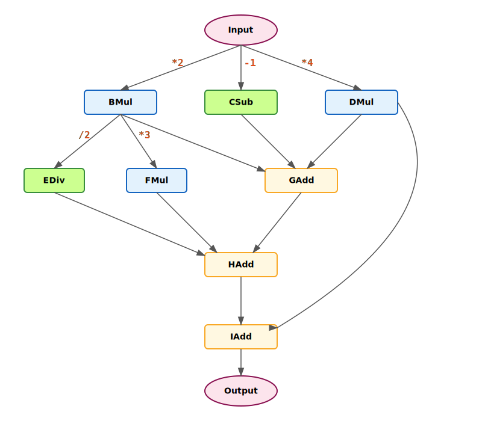
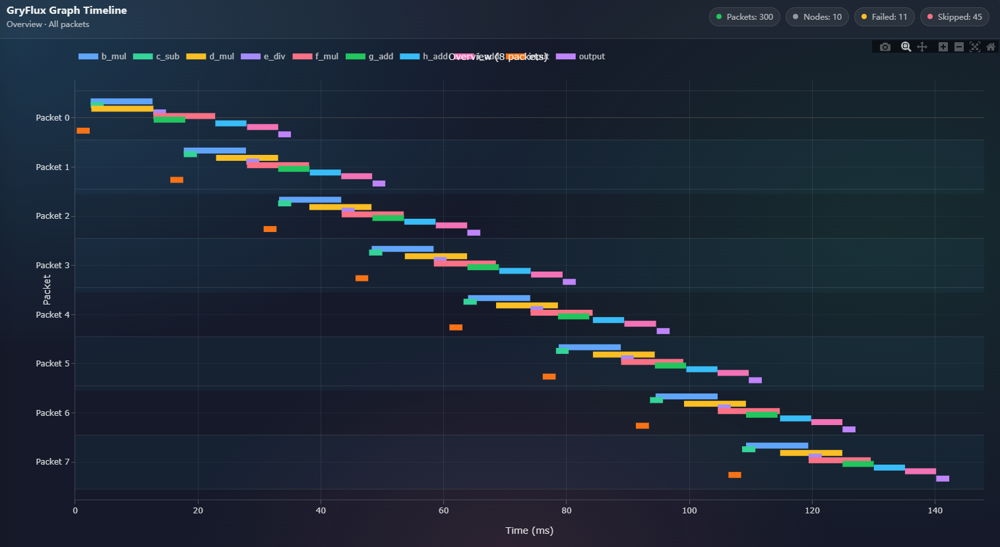

# GryFlux Framework - example

## 示例说明

本示例用于演示：

- 如何在 GryFlux 中构建自定义 DAG
- 如何使用资源池抽象“加法器/乘法器”等受限资源
- 如何通过模拟耗时与 profiling 观察吞吐瓶颈
- 如何通过调整上下文资源、线程池大小和最大活跃包数等来观察并行工作
- 如何在节点中注入异常，观察框架的错误处理

## 快速上手

下面用展示如何定义节点、创建 Context、构建 DAG、绑定资源，并运行异步管道。

### 1) 定义数据包（DataPacket）

数据包是流经整个 DAG 的载体。在构造函数中预分配中间结果，避免运行时频繁分配。

```cpp
struct MyPacket : public GryFlux::DataPacket {
	int id = 0;
	std::vector<float> a;
	std::vector<float> out;

	MyPacket() : a(256), out(256) {}
};
```

### 2) 定义节点（NodeBase）

节点只需要继承 `GryFlux::NodeBase` 并实现 `execute()`。

本示例中，CPU 节点通过构造参数接收 `delayMs`，用于 `sleep_for` 模拟耗时；
受限资源节点（adder/multiplier）把延时放在 `Context` 内部。

```cpp
class InputNode : public GryFlux::NodeBase {
public:
	explicit InputNode(int delayMs) : delayMs_(delayMs) {}

	void execute(GryFlux::DataPacket &packet, GryFlux::Context &ctx) override {
		(void)ctx;
		auto &p = static_cast<MyPacket&>(packet);
		for (auto &v : p.a) v = static_cast<float>(p.id);
		std::this_thread::sleep_for(std::chrono::milliseconds(delayMs_));
	}

private:
	int delayMs_;
};
```

### 3) 定义 Context（资源上下文）

当某个节点需要“受限硬件资源”（例如本示例里的 adder/multiplier）时，你需要定义一个 `GryFlux::Context` 子类，用于封装该资源的操作接口。

```cpp
class MultiplierContext : public GryFlux::Context
{
public:
    explicit MultiplierContext(int deviceId, int delayMs = 0)
        : deviceId_(deviceId), delayMs_(delayMs) {}

    int getDeviceId() const { return deviceId_; }

    std::vector<float> mul(const std::vector<float> &a, const std::vector<float> &b)
    {
        const size_t size = std::min(a.size(), b.size());
        std::vector<float> out(size);
        for (size_t i = 0; i < size; ++i)
        {
            out[i] = a[i] * b[i];
        }
        if (delayMs_ > 0)
        {
            std::this_thread::sleep_for(std::chrono::milliseconds(delayMs_));
        }
        return out;
    }

private:
    int deviceId_ = 0;
    int delayMs_ = 0;
};
```

### 4) 注册资源池（ResourcePool）

当节点需要受限硬件资源时，先注册对应资源类型：

```cpp
constexpr size_t kAdderInstances = 2;   // To register 2 adder resources
constexpr int kAdderDelayMs = 5;

auto resourcePool = std::make_shared<GryFlux::ResourcePool>();
{
    std::vector<std::shared_ptr<GryFlux::Context>> adderContexts;
    adderContexts.reserve(kAdderInstances);
    for (size_t i = 0; i < kAdderInstances; ++i)
    {
        adderContexts.push_back(std::make_shared<AdderContext>(
            static_cast<int>(i),
            kAdderDelayMs));
    }
    resourcePool->registerResourceType("adder", std::move(adderContexts));
}
```

### 5) 构建 DAG（GraphTemplate + TemplateBuilder）

通过 `GraphTemplate::buildOnce()` 定义拓扑：

- `setInputNode<T>`：输入节点
- `addTask<T>`：普通任务节点（可指定资源类型名，空字符串表示 CPU 任务）
- `setOutputNode<T>`：输出节点

```cpp
constexpr int kCpuDelayMs = 2;

auto graphTemplate = GryFlux::GraphTemplate::buildOnce(
	[=](GryFlux::TemplateBuilder *builder) {
		builder->setInputNode<PipelineNodes::InputNode>("input", kCpuDelayMs);

		// resourceTypeName: "multiplier" / "adder" / "" (CPU)
		builder->addTask<PipelineNodes::BMulNode>("b_mul", "multiplier", {"input"});
		builder->addTask<PipelineNodes::CSubNode>("c_sub", "", {"input"}, kCpuDelayMs);
		builder->addTask<PipelineNodes::GAddNode>("g_add", "adder", {"b_mul" /* ... */});

		builder->setOutputNode<PipelineNodes::OutputNode>("output", {"g_add"}, kCpuDelayMs);
	}
);
```

### 6) 运行异步管道（AsyncPipeline）

```cpp
auto source = std::make_shared<SimpleDataSource>(NUM_PACKETS);
auto consumer = std::make_shared<ResultConsumer>();

GryFlux::AsyncPipeline pipeline(
	source,
	graphTemplate,
	pool,
	consumer,
	kThreadPoolSize,
	kMaxActivePackets
);

pipeline.run();
```

## 示例 DAG 结构

DAG结构图：



当前资源绑定：

- `multiplier(蓝)`：BMul、DMul、FMul
- `adder(黄)`：GAdd、HAdd、IAdd
- `CPU(绿)`无资源：Input、CSub、EDiv、Output

## 模拟耗时

延时分两类：

1) **CPU 节点**：通过 `addTask()/setInputNode()/setOutputNode()` 传入 `delayMs`，在节点实现里 `sleep_for`。
2) **受限资源 Context（adder/multiplier）**：延时在 `Context` 内部统一处理。

相关参数：

- `kCpuDelayMs`
- `kAdderDelayMs`
- `kMultiplierDelayMs`

可以通过调整不同资源的延时来制造瓶颈。

## Profiling 编译与运行

profiling 是“编译期开关 + 运行时启用”两段式：

1) 编译期开关：编译时定义 `GRYFLUX_BUILD_PROFILING=1`
2) 运行时启用：示例中在 `kBuildProfiling` 为 true 时调用 `pipeline.setProfilingEnabled(true)`

推荐使用脚本编译并安装：

```bash
cd /workspace/gxh/GryFlux
bash ./build.sh --enable_profile
```

运行：

```bash
./install/bin/example
```

运行结束会输出 profiling 统计，并生成 `graph_timeline.json` 用于可视化。

浏览器打开 http://profile.grifcc.top:8076/ 并选择相应 json 文件生成 timeline

该 timeline 对应的配置参数如下：
```cpp
constexpr size_t kThreadPoolSize = 24;
constexpr size_t kMaxActivePackets = 4;
// kMaxActivePackets is considered to be greater than Theoretical Max Throughput * average packet consume time 
constexpr size_t kAdderInstances = 2;   // To register 2 adder resources
constexpr size_t kMultiplierInstances = 2;  // To register 2 multiplier resources
constexpr int kCpuDelayMs = 2;
constexpr int kAdderDelayMs = 5;
constexpr int kMultiplierDelayMs = 10;
constexpr int producerTimeMs = 15	// ms/packet
// producerTimeMs should be greater than (1 / Theoretical Max Throughput) to keep the system stable
```
可以看到：
- 单个 packet 内部节点的运算顺序严格依照计算图进行
- 由于资源限制，同时最多只有两个乘法节点在运行；同时最多只有四个包在运行
- 系统稳定，框架面对源源不断的 packet 输入时有着非常清晰的流式处理

## 吞吐量分析

示例会在运行结束打印两行：

- `Theoretical Max Throughput`: 一个基于“线程池 + source生产速度 + 资源实例数 + 延时配置”的粗略上界估计
- `Throughput`: 实测吞吐

吞吐上限的计算方式：

- 资源实例数 / 每个 packet 在该资源上消耗的总时间
- 例如：`multiplier` 相关节点：BMul、CMul、FMul（每个 packet 需要使用 3 次 multiplier）
    - `kMultiplierDelayMs = 10ms`，`kMultiplierInstances = 2`，那么 multiplier 的吞吐上限大致是：
	**2 / 30ms ≈ 66.7 packet/s**

最终的“理论最大吞吐”通常由最紧的那个上限决定。

`kMaxActivePackets` 对吞吐的影响：

- **Little's Law: $L = λ * W$**

含义（稳定系统）：

- $L$：系统平均在途包数（可近似理解为 `activePackets`）
- $\lambda$：平均吞吐（packets/s）
- $W$：端到端平均时延（s）

因此，如果希望 `Throughput` 能尽可能接近 `Theoretical Max Throughput`，通常需要：

- `kMaxActivePackets` 至少覆盖 $\lambda \cdot W$

估算方法：

1) $\lambda$ 可取理论最大吞吐（$\lambda \approx 1 / producerTimeMs \approx 66.7 packets/s$）
2) $W$ 可用 profiling 统计平均耗时，可以由关键路径 + 生产者 + 消费者的总耗时估算

（本例的关键路径是Input → BMul → FMul → HAdd → IAdd → Output,约为 **35ms**，再加生产者与消费者的总耗时 **15ms**，共 **50ms**）

3) $L ≥ 66.7 packets/s * 0.05 s \approx  3.33 packet$

- 因此 `kMaxActivePackets` 取值大于等于 **4** 比较合理，不会约束实际吞吐。

注意：即使资源/线程池有余量，下面这些也影响实际吞吐：

- 数据源 `produce()` 的 sleep/IO（本示例里有模拟 sleep）
- consumer 的重日志打印（大量 `INFO` 会显著影响吞吐）
- 节点或资源报错导致了个别节点或数据包无需被消费
- 操作系统调度、CPU 频率、核数、NUMA 等环境因素


## 故障注入

为观察框架如何处理节点执行失败：

- 在节点 `GSum` 内部生成一个整数 0-49 范围内的均匀分布，当生成的随机数为 1 时会触发错误
- 在节点 `CSub` 内部生成一个整数 0-99 范围内的均匀分布，当生成的随机数为 1 时会触发错误
- 抛异常的 packet 会被框架判定为失败并丢弃（consumer 不会收到它）

因此，本示例中的 failure 统计采用更贴近“流式处理”的口径：

- `Failure = Source 产生(总输入) - Consumer 实际消费`

## 打印日志

**[INFO] 正常运行**
```
[INFO ] Packet 7: ✓ PASS (output[0] = 125.0, sum = 32000.0, expectedSum = 32000.0, error = 0.000000)
[INFO ] Packet 8: ✓ PASS (output[0] = 143.0, sum = 36608.0, expectedSum = 36608.0, error = 0.000000)
[INFO ] Packet 9: ✓ PASS (output[0] = 161.0, sum = 41216.0, expectedSum = 41216.0, error = 0.000000)
```

**[ERROR]/[WARN] Packet 或 Node 报错**
```
[ERROR] Packet 15: Injected error in node 'g_add'
[ERROR] Node 'g_add' (index 6) execution failed: Simulated error in GAddNode
[WARN ] Dropping failed packet id=15
```

**吞吐量和Failure统计**
```
[INFO ] All 300 packets completed in 4630 ms
[INFO ] Average: 15.43 ms/packet
[INFO ] Theoretical Max Throughput: 66.67 packets/sec
[INFO ] Throughput: 64.79 packets/sec
[INFO ] ========================================
[INFO ] Verification Results:
[INFO ]   ✓ Consumed: 289 packets
[INFO ]   ✗ Failure : 11 packets
```